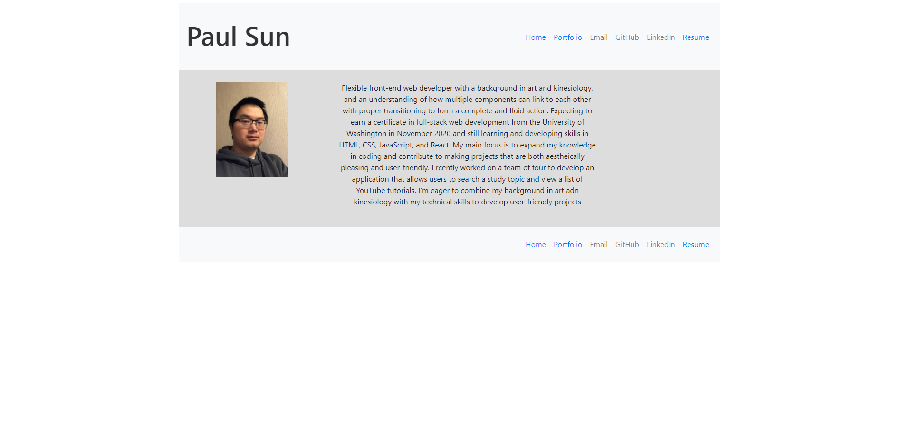
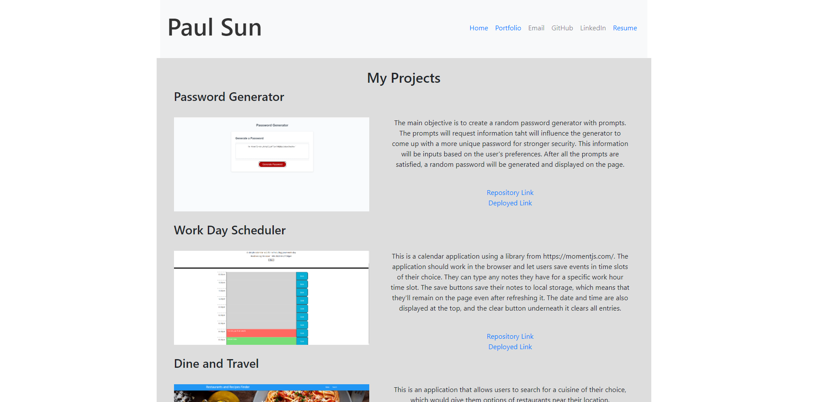

# React-Portfolio

## Description

This is the homework for week twenty. The point is to create a portfolio page using React. A third party router will be used so that a Header, Projects, and Footer component will appear on multiple pages. 

## Screenshots

## Links

* https://github.com/LostandConfusedStudent/React-Portfolio
* https://lostandconfusedstudent.github.io/React-Portfolio/